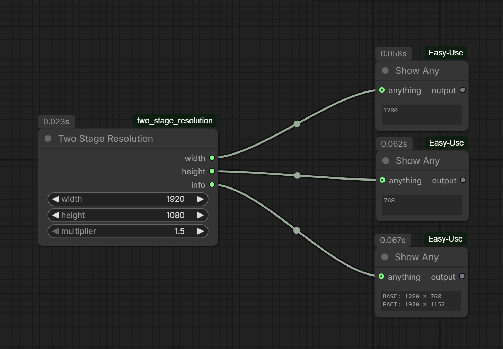

# Two Stage Resolution Node

ComfyUI custom node для расчёта двухэтапного разрешения видео.

## Описание

Нода вычисляет базовое и финальное разрешение для двухэтапного апскейла:
- **Базовое разрешение (BASE)** — исходное разрешение перед апскейлом
- **Финальное разрешение (FACT)** — результат после применения множителя, выравненный по шагу

## Входы

| Параметр | Тип | По умолчанию | Описание |
|----------|-----|--------------|---------|
| **width** | INT | 1920 | Ширина (64-8192) |
| **height** | INT | 1080 | Высота (64-8192) |
| **multiplier** | FLOAT | 1.5 | Множитель (1.5 или 2) |

## Выходы

| Выход | Тип | Описание |
|-------|-----|---------|
| **width** | INT | Базовая ширина |
| **height** | INT | Базовая высота |
| **info** | STRING | Информация о расчётах |

## Пример

Вход: 1920×1080 с множителем 2.0
- Выход: базовое 1920×1080, финальное 3840×2160

## Установка

1. Скопируй `two_stage_resolution.py` в папку `custom_nodes` ComfyUI
2. Перезагрузи ComfyUI
3. Нода будет доступна в категории `video/resolution`
